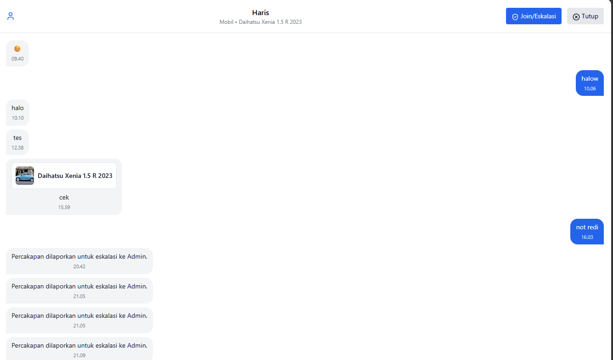
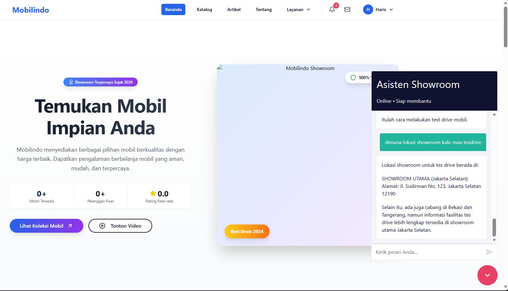
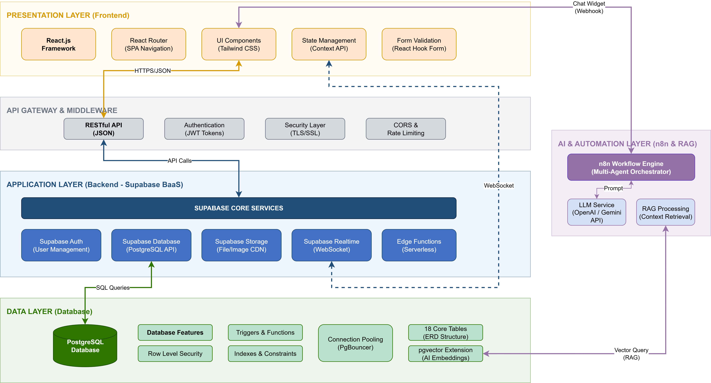

# Mobilindo — Sistem Penjualan dan Pembelian Mobil Bekas Berbasis Website
 
> **Proyek Tugas Akhir Kelompok**  
> Showroom Surya Abadi Mobilindo
 
---
 
**Mobilindo** adalah aplikasi web terintegrasi untuk manajemen jual-beli mobil bekas yang dirancang khusus untuk Showroom Surya Abadi Mobilindo. Sistem ini menggantikan pencatatan manual dengan platform digital yang mencakup manajemen inventaris, transaksi, simulasi kredit, hingga layanan chatbot berbasis AI.
 
Proyek ini merupakan hasil kolaborasi dua mahasiswa dengan fokus penelitian yang saling melengkapi:
 
| Sub Judul | Fokus | Peneliti |
|-----------|-------|----------|
| **Analisis dan Perancangan Sistem Informasi Jual-Beli Mobil Bekas pada Aplikasi Mobilindo Berbasis Website** | Core sistem: database, arsitektur, UML, simulasi kredit, frontend & backend | [Harish Falih Agniawan] |
| **Integrasi Chatbot Multi-Agent dan RAG Chatbot Berbasis N8N untuk Optimalisasi Layanan Showroom Mobil** | AI layer: chatbot RAG, multi-agent, automation workflow N8N | [Andre Dzikry Surya Atmojo] |
 
---

**Preview**

Berikut adalah dokumentasi antarmuka dari aplikasi Mobilindo yang menampilkan berbagai fitur utama:

| | | |
|:---:|:---:|:---:|
|  <br> **Halaman Login** |  <br> **Katalog Mobil** |  <br> **Detail Kendaraan** |
|  <br> **Simulasi Kredit** |  <br> **Booking Test Drive** |  <br> **Formulir Pemesanan** |
|  <br> **Detail Transaksi** |  <br> **Status Pembelian** |  <br> **Riwayat Transaksi** |
|  <br> **Fitur Chatting** |  <br> **AI Assistant** |  <br> **Eskalasi Chat ke Admin** |
|  <br> **Dashboard Admin** |  <br> **Manajemen Test Drive** |  <br> **Kelola Transaksi** |
|  <br> **Analisis Eksekutif** |  <br> **Opsi Paket Iklan** |  <br> **Pengajuan Iklan** |
|  <br> **Portal Berita** | | |

**Fitur**

- **Katalog Mobil & Pencarian**: Penjelajahan inventaris mobil dengan fitur filter berdasarkan merk, harga, dan spesifikasi.
- **Perbandingan Mobil**: Fitur untuk membandingkan spesifikasi beberapa mobil secara berdampingan.
- **Simulasi Kredit**: Kalkulator pinjaman otomatis untuk membantu pengguna merencanakan pembiayaan.
- **Manajemen Transaksi**: Alur pembelian mobil yang terintegrasi, mulai dari pemesanan hingga invoice.
- **Test Drive & Trade-In**: Sistem penjadwalan uji coba kendaraan dan pengajuan tukar tambah secara online.
- **AI Chatbot**: Asisten pintar berbasis AI untuk menjawab pertanyaan umum dan bantuan navigasi.
- **Dashboard Admin**: Pengelolaan data mobil, pengguna, iklan, dan moderasi konten.
- **Dashboard Eksekutif**: Visualisasi data statistik, KPI, dan laporan analisis bisnis bagi pemilik showroom.
- **Sistem Konten (CMS)**: Pengelolaan artikel otomotif dan konten edukasi bagi pengguna.
- **Pesan Real-time**: Fitur komunikasi langsung antara calon pembeli dan pihak dealer.

**Arsitektur dan Teknologi**

Proyek ini dibangun menggunakan arsitektur modern berbasis **React.js** untuk frontend dan **Node.js** untuk backend, dengan dukungan **TypeScript** untuk pengembangan yang lebih terstruktur. Berikut adalah diagram arsitektur aplikasi:



- **Frontend**:
  - **Framework**: React.js dengan TypeScript untuk pengetikan statis yang aman.
  - **Styling**: Tailwind CSS dan Shadcn UI untuk komponen antarmuka yang konsisten.
  - **State Management**: React Context API.
  - **Animasi**: Framer Motion untuk transisi yang halus.
- **Backend**:
  - **Runtime**: Node.js dengan framework Express.js.
  - **Database**: PostgreSQL (Managed by Supabase).
  - **ORM**: Sequelize untuk manajemen skema database.
- **Layanan Pihak Ketiga**:
  - **Supabase**: Digunakan untuk autentikasi, database cloud, dan penyimpanan berkas.
  - **Google Drive API**: Integrasi tambahan untuk manajemen dokumen tertentu.

**Cara Menjalankan Projek**

Pastikan Anda telah menginstal Node.js dan npm di sistem Anda.

1. **Persiapan Database**:
   - Siapkan proyek di [Supabase](https://supabase.com/).
   - Jalankan skrip migrasi yang tersedia di folder `backend/migrations`.

2. **Konfigurasi Backend**:
   - Masuk ke direktori backend: `cd backend`
   - Instal dependensi: `npm install`
   - Buat file `.env` dan lengkapi konfigurasi (Supabase URL, Key, Port, dll).
   - Jalankan server: `npm run dev`

3. **Konfigurasi Frontend**:
   - Masuk ke direktori frontend: `cd frontend`
   - Instal dependensi: `npm install`
   - Buat file `.env` untuk konfigurasi API: `REACT_APP_SUPABASE_URL` dan `REACT_APP_SUPABASE_ANON_KEY`.
   - Jalankan aplikasi: `npm start`

**Struktur Folder Utama**

```text
bismillahtashowroom/
├── backend/                # Source code server (Express.js)
│   ├── src/
│   │   ├── config/         # Konfigurasi database & layanan
│   │   ├── controllers/    # Logika bisnis per entitas
│   │   ├── models/         # Definisi skema database
│   │   ├── routes/         # Definisi endpoint API
│   │   └── services/       # Layanan pendukung (Notifikasi, Laporan)
│   └── migrations/         # Skrip SQL untuk setup database
├── frontend/               # Source code antarmuka (React.js)
│   ├── public/             # Aset statis publik
│   └── src/
│       ├── components/     # Komponen UI reusable (Atomic design)
│       ├── contexts/       # State management (Auth context)
│       ├── controllers/    # Penghubung UI ke layanan API
│       ├── entities/       # Definisi tipe data & entitas
│       ├── pages/          # Komponen halaman utama aplikasi
│       └── services/       # Integrasi API dan logika eksternal
└── testsprite_tests/       # Kumpulan skrip pengujian otomatis (E2E)
```
